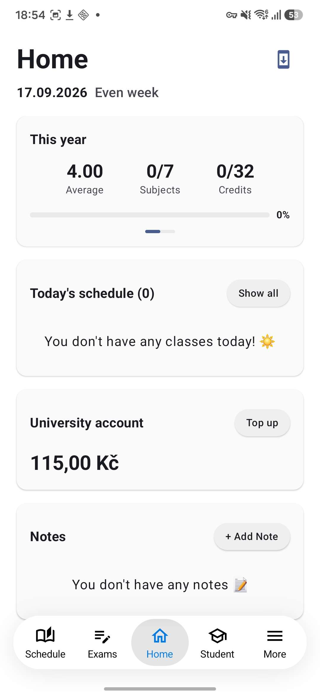
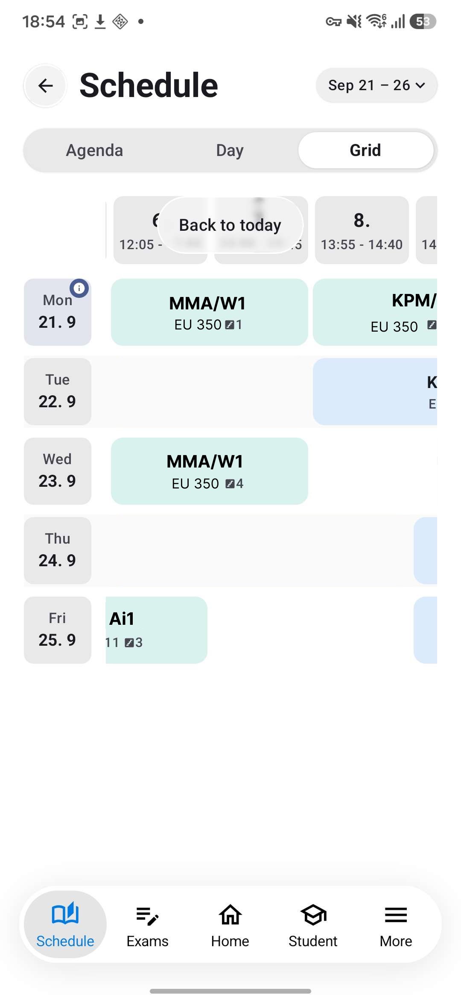
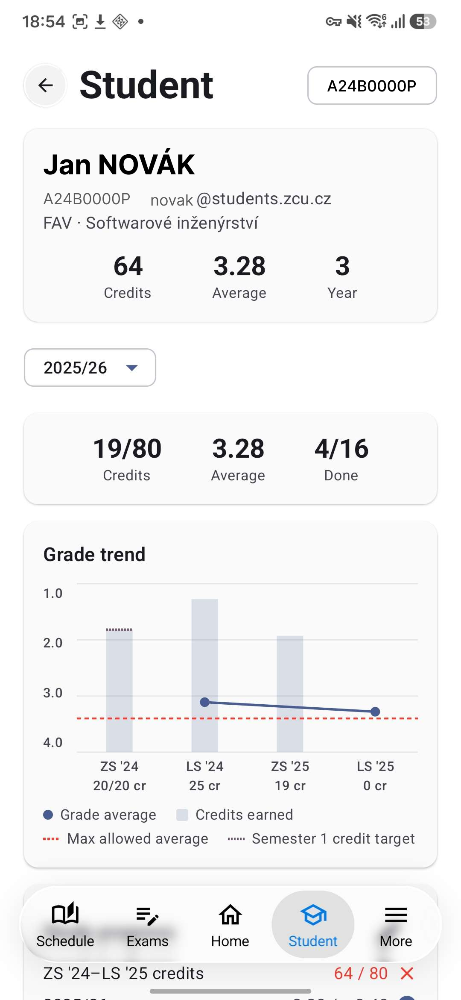
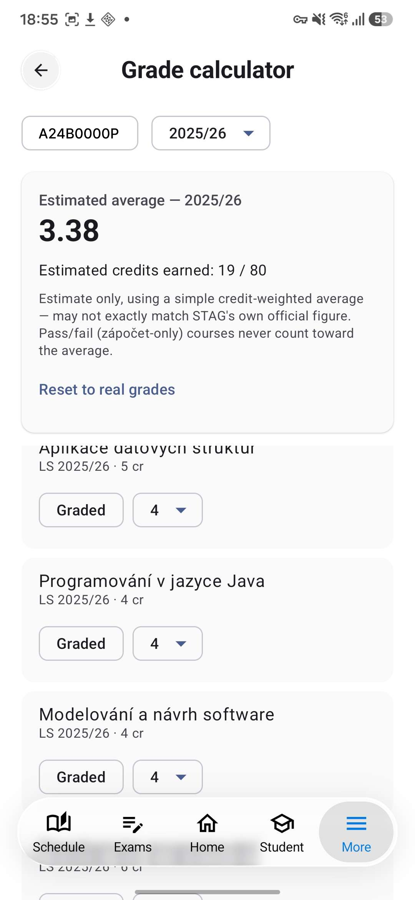

# StagClient

*Unofficial · ZČU STAG*

A fast, native Android app for ZČU's STAG system — schedule, exams,
grades, canteen menu and your university account balance, talking
directly to STAG's own API instead of going through the official ISSTAG
app.

**[⬇ Install the latest version](https://github.com/snipexos/stagclient/releases/latest)** · [All releases](https://github.com/snipexos/stagclient/releases)

## Screenshots

  
  
  
  

## Installing

1. Tap **Install the latest version** above — this downloads the APK file
   straight to your phone.
2. Open the downloaded file. Android will warn about installing from an
   unknown source the first time — allow it for your browser/files app.
3. Install, open, log in with your ZČU credentials. That's it.
4. The app checks for new versions itself from then on and offers to
   update in place.

---

Unofficial, community-made. Not affiliated with ZČU or IS/STAG.
